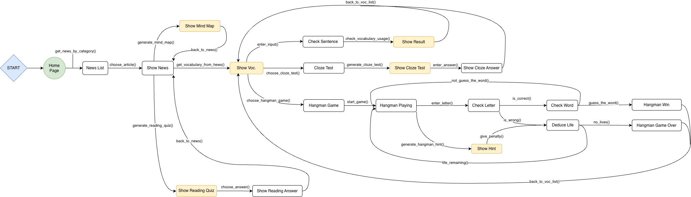
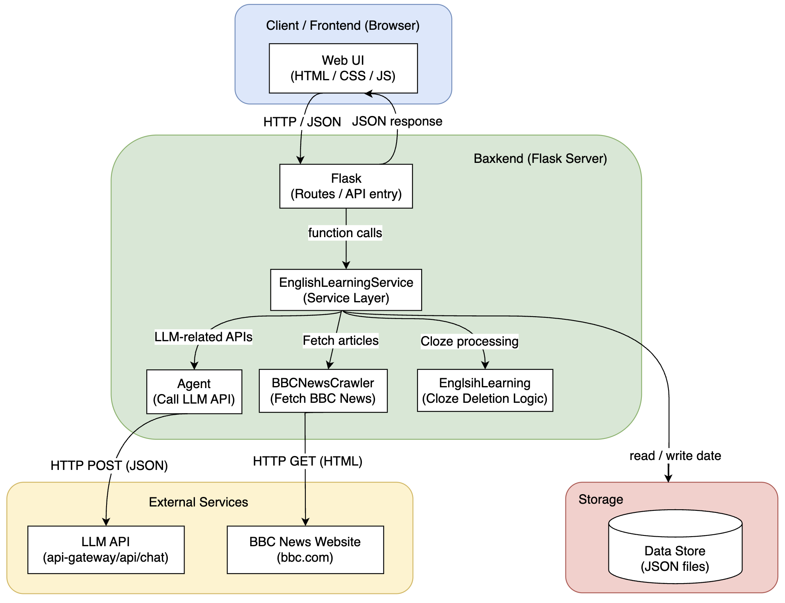

# TOC Final Project: VocaGent
## Project Introduction
This project is an English learning system that integrates BBC News with Large Language Models (LLMs). Users can select their preferred BBC news categories, and the system automatically crawls the latest articles. Utilizing an LLM, the system then extracts a customized vocabulary list based on the user's specified CEFR level.

After studying the vocabulary, the system offers several practice modes to evaluate learning progress, including:

- Sentence Construction Feedback: Users practice writing sentences with new words, and the LLM provides grammar checks and feedback in Chinese.
- Cloze Tests (Fill-in-the-blanks): The LLM generates a short passage based on specific vocabularies and creates a cloze test for the user to complete.
- Hangman Game: A classic word-guessing game using the vocabulary list. Users can spend "lives" to receive hints—provided by the LLM as English descriptions rather than direct answers.
- Mind Mapping & Reading Comprehension: To help users grasp article structures and improve overall comprehension, the LLM generates mind map structures and customized reading quizzes based on the news content.

The primary goal of this project is to enable users to learn English from authentic news sources. By leveraging LLMs for interactive practice and real-time feedback, we aim to transform English learning into an engaging and dynamic experience.

## Features
1. **BBC news crawler**
    
    The system scrapes the latest article titles and content from BBC based on categories (e.g., News, Business, Sport), providing real-time reading material for users.
2. **Organize words based on CEFR levels**

    Analyzes selected articles using an LLM to extract key vocabularies based on a specified difficulty level (e.g., B1/B2) and quantity. Each word includes its part of speech, Chinese definition, and example sentences.
3. **Sentence correction**
    
    Users practice by constructing sentences with the new vocabularies. The system utilizes an LLM to check grammar and usage, providing detailed explanations and feedback in Chinese.
4. **Cloze test practice**

    The LLM generates a short passage and the backend automatically hides specific vocabulary words, creating a fill-in-the-blank exercise for users to test their retention.
5. **Hangman game**

    A random word is selected from the vocabulary pool for a game of Hangman. The interface displays remaining lives and current progress. Users can sacrifice a "life" to receive an LLM-generated hint—an English description of the word rather than the answer itself.
6. **Mind mapping**

    To enhance reading comprehension and structural analysis, the LLM generates a hierarchical mind map structure based on the article, which is then rendered visually by the frontend.
7. **Reading comprehension quizzes**

    To ensure a thorough understanding of the news content, the system uses an LLM to generate five comprehension questions (e.g., True/False, Single Choice, or Multiple Choice).
## Finite State Machine


## System Architectutre


## Project Structure
   
    project-root/
    ├── app.py                      # Flask entry point, defines backend APIs
    ├── agent.py                    # Handles LLM API calls and prompt logic
    ├── english_learning_service.py # Service layer: Integrates crawler, agent, and learning logic
    ├── english_learning.py         # Logic for cloze test generation and word masking
    ├── news_crawler.py             # BBC News crawler logic
    ├── data/                       # Directory for generated or static data
    │   ├── news/                   # Stores categorized news articles
    │   ├── vocabulary/             # Vocabulary lists and sentence feedback logs
    │   ├── cloze/                  # Cloze test questions and examples
    │   ├── hangman/                # Hangman word sets and descriptions
    │   ├── reading.json            # Sample data for reading comprehension quizzes
    │   └── mindMap.json            # Sample data for mind map structures
    ├── static/
    │   ├── css/                    # HTML stylesheets
    │   └── hangman/                # Hangman visual images
    ├── templates/                  # Flask HTML templates
    │   ├── index.html              # Homepage: News category selection
    │   ├── news_list.html          # List view of crawled news articles
    │   ├── news_detail.html        # Article view and vocabulary extraction
    │   ├── vocabulary.html         # Sentence construction practice page
    │   ├── cloze.html              # Cloze test exercise page
    │   ├── hangman.html            # Hangman game interface
    │   ├── reading.html            # Reading comprehension quiz page
    │   └── mindMap.html            # Mind map visualization page
    └── README.md                   # Project documentation

    
## Installation & Usage
### 1. Clone this repository
```
cd <your-repo-folder>
git clone https://github.com/Ericchenbang/TOC-Final-Project-VocaGent.git
```

### 2. Setup Python environment
1. Method 1
```
conda env create -f environment.yml --name my_env
conda activate my_env
```

2. Method 2
```
pip install -r requirements.txt
```

### 3. Configure LLM API credentials
1. macOS and Linux
```
export OLLAMA_API_KEYY="your_api_key_here"
```

2. Windows in PowerShell
```
$env:OLLAMA_API_KEY="your_api_key_here"
```
### 4. Run the Flask backend
1. Method 1
```
flask run 
```
2. Method 2
```
python app.py
```

### 5. Using the web UI
```
http://127.0.0.1:5000/
```

## Division of Work
|   Student ID     | Name  |       Responsible for projects                |
|:---------:| ------| -------------------------------|
|  E14114174| 陳彥定 | Frontend and Backend                    |
| C24116095 | 黃紋綺 |Agent,  BBCNewsCrawler, EnglishLearningService Class    |
